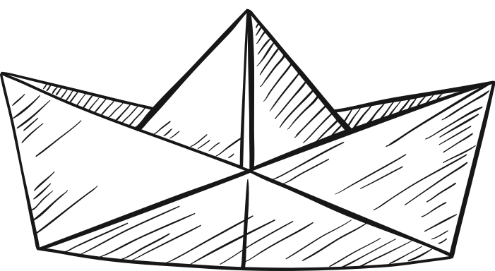
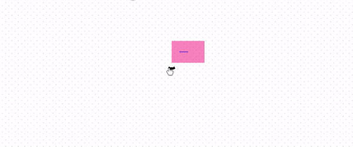
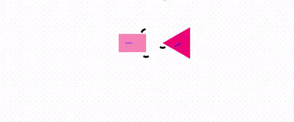
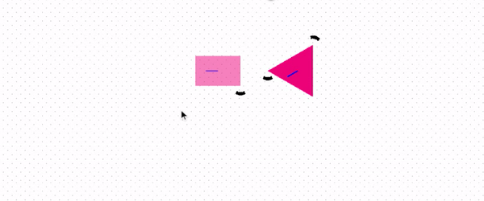
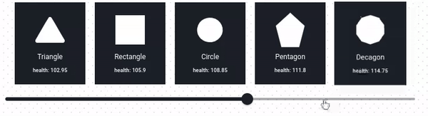
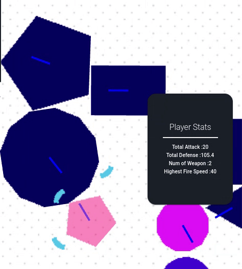
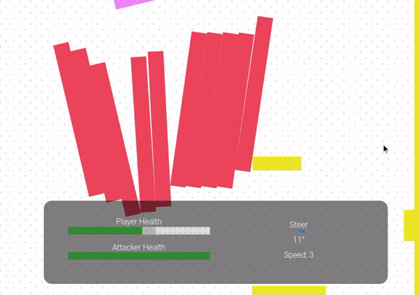
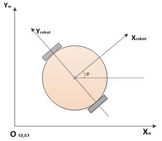

<br />


<h1 align="center">
PaperCraft
</h1>

<h6 align="center">
An easy-to-use, minimized 2D shooter game with extensive crafting capabilities.
Supporting crafting and battlegrounds.
  <br />
  <a href="https://papercraft-eight.vercel.app/">View Demo</a>
  ·
  <a href="https://github.com/cy-moi/papercraft/issues">Report Bug</a>

</h6>
<div align="center">

</div>

---

<br />

## Craftground

When in the craftground, the user can choose the basic shape of the vessel, and weapons to attach to it.
The slider changes the size of the vessel.
After adding a weapon, you can drag and drop it to one of the other corners of the vessel (the corners appear when dragging the weapon).
Simply drop it outside to delete it.
Change the slider value to change weapon rotation.
The top-right corner cart is displaying the player's vessel's statistics
You can press [a] key to see it shoot before entering the battleground.

### Drag and Drop
<div align="center">
<a>drag and drop weapons to auto-highlighted locations</a>
<br />

<br />
<a>drag and drop across vessels</a>
<br />

<br />
<a>drag, drop and throw to dispose</a>
<br />

</div>

### UI
<div align="center">
<a>slider and shape selector</a>
<br />

<br />
<a>pan and zoom</a>
<br />

<br />
<a>lively updated stats for comparation</a>
<br />

</div>

## Playground

The playground is simply the game battleground, where the just-created vessel can shoot at enemies. The enemies are static obstacles, move-able obstacles, and an attacking vessel. The mirroring vessel will have the same speed as the player and try to face at the player to shoot at it. Use arrow keys to move around, `[C] (Capital)`key to brake the vessel, `a` key to shoot!

### UI
battle UI has health bars for both sides, and a control panel where the user can see their current steering degrees and speed.
<div align="center">

</div>

### Player: Differential wheeled robot
For the motion model of the player, we adapted the differential wheeled robot which is very practical (robotics 101) and realistic. The `left` and `right` key will control the steering, but here the steer degree will be translated to the wheel differences.
<div align="center">

</div>


# How to run

**Node version: 16.xx.x is required**

1. Clone the repository

```bash
$ git clone
```

2. Install dependencies

```bash
$ yarn install --forzen-lockfile
```

3. Build the project

```bash
$ yarn build
```

4. Run the project locally

```bash
$ yarn start
```

Refer to `package.json` and `yarn.lock` if any pacakge version conflicts happen. Remove `yarn.lock` file if you are not using `yarn`.

# Develop

- `master` is the stable production branch.
- `dev` branch has the most recent changes.
- Branch naming: `[branch from]-[feature]`, e.g., `dev-dnd` is branched from `dev` for `drag-n-drop` features. This rule can be chained.

# TODO

1. Add another layer of shape creation APIs which will create corresponding polygons.
2. ✅ Add weapon/defense slot properties to static shape: another class of shapes inherented from the basic shapes. The MobileShape class will inherent this class.
3. Add boudaries to the creation sesssion
4. ✅ Fix the viewport, limit the movement with boundaries
5. ✅ Procedural generation of enemies - need to fix some obstacles textures to make it looks better
6. ☑️ The ui of vessel creation

# Bucket

1. Arrows for weapons
2. Arrow damage depends on color
3. Drag and drop should be handeled by pixi
4.

# References

[Pixi boilerplate](https://github.com/dopamine-lab/pixi-boilerplate).
